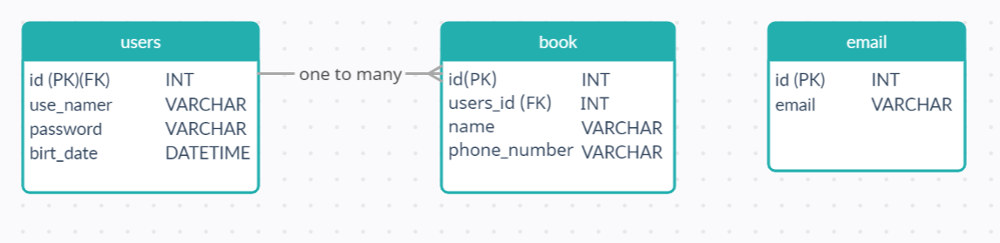
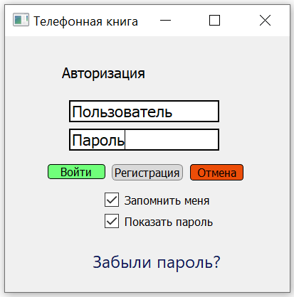
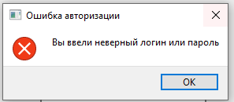
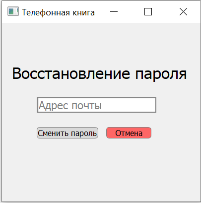
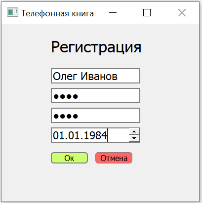
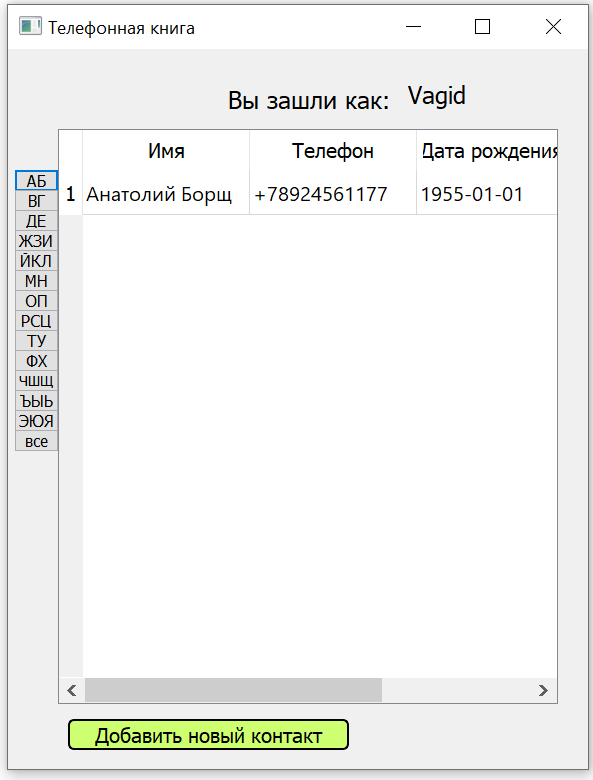
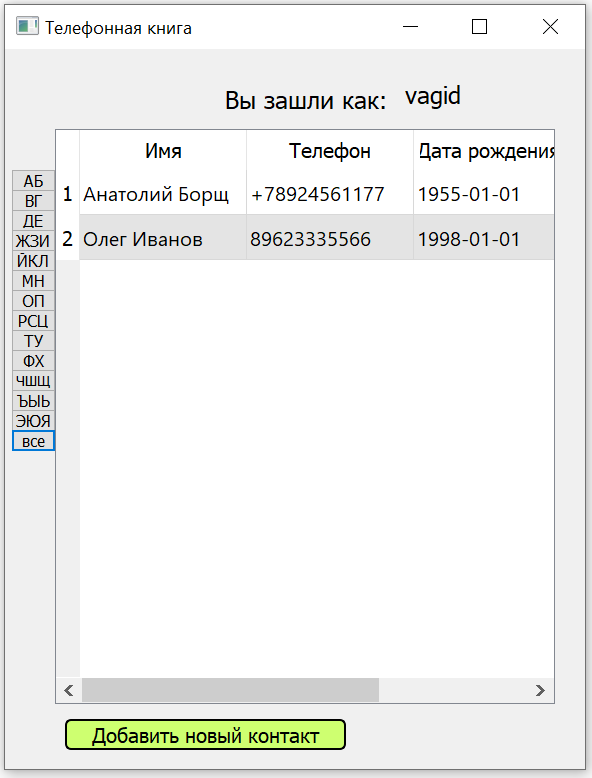
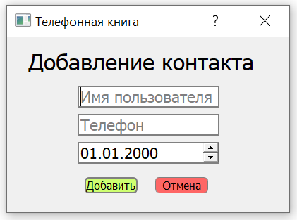
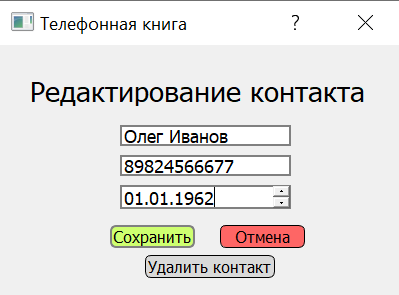

## Структура базы данных

Схема базы данных



Создайте базу данных согласно схеме или импортируйте базу с файла dump.sql


## Инструкция по разворачиванию приложения

1) Скачайте репозиторий, у бедитесь что у вас установлен Python откройте командную строку 
2) Прейдите в директорию с проектом
2) Устанавливаем все необходимые пакеты ```pip install -r requirements.txt``` or ```pip3 install -r requirements.txt``` 
4) В папке repository откройте файл phone_book_repository.py  измените параметры для доключения к БД 
3) Введите команду ```python main.py``` or ```python main.py```


## Руководство пользователя

После запуска программы, перед пользователем появляется окно авторизации.



Пользователь вводит логин и пароль, нажимает кнопку «Войти». В случае отсутствия пользователя с такими данными в БД, появляется всплывающее окно.



Если пользователь забыл пароль – по нажатию на ссылку «Забыли пароль?» открывается окно для восстановления пароля.



При нажатии на кнопку «Регистрация» открывается окно «Регистрация»



В случае успешного входа/регистрации перед пользователем открывается главное окно приложения.


После нажатия по клавише со списком букв, выводится список контактов из этого диапазона букв.



После нажатия по пустой клавише все, выводится список всех контактов пользователя.



При нажатии на кнопку «Добавить новый контакт» открывается окно добавления нового контакта.



Запись о новом пользователе автоматически добавляется в книжку.

По нажатию любого из полей контакта, появляется окно «Редактирование контакта».



В этом же окне есть возможность удалить выбранный контакт по кнопке «Удалить контакт»:


*Аналогично с добавлением, после редактирования или удаления контакта, данные в таблице автоматически обновляются.*


1) python 3.8 
2) PyQt5 5.15
3) Qt Designer 5.15
4) MariaDB 10.6
5) OC - Linux